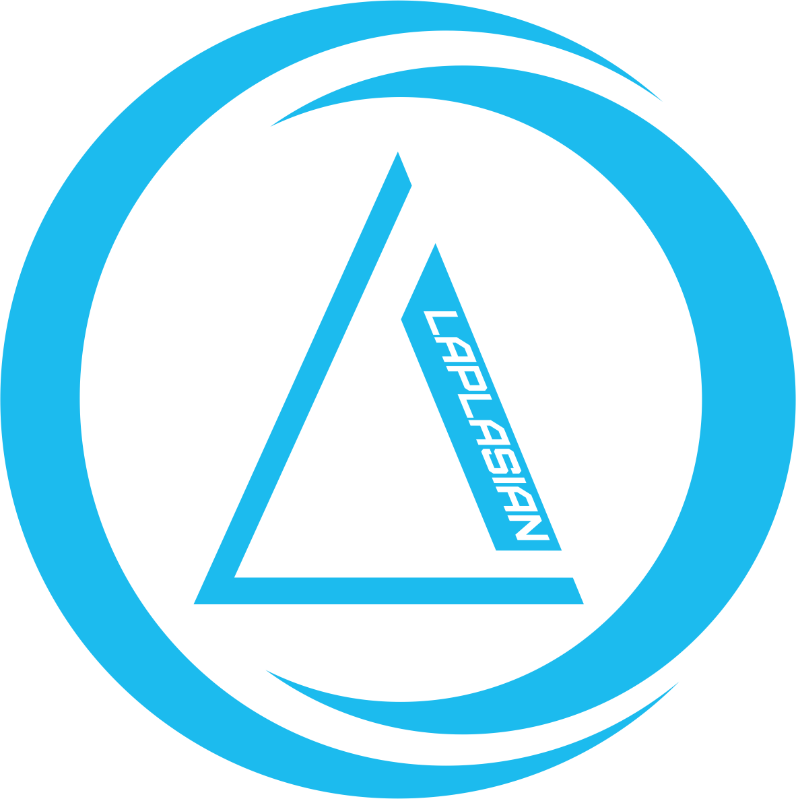

<!DOCTYPE html>
<html lang="ru">
<head>
    <meta charset="UTF-8">
    <meta name="viewport" content="width=device-width, initial-scale=1.0">
    <title>Квинжесенция - Квантовый Хакатон</title>
    
</head>
<body>

<header>
    <h1>Квинжесенция</h1>
</header>

<nav>
    <a href="index.html">Главная</a>
    <a href="task/task1.html">Задача 1: Инвестиционный Портфель</a>
    <a href="task/task2.html">Задача 2: Оптимизация Маршрутов</a>
    <a href="task/task3.html">Задача 3: Семантический Анализ</a>
</nav>

<main id="content">
    <section class="team-title">
        <h2>Команда Квинжесенция</h2>
    </section>

    <section class="team-section">
        <h2>Наша Команда</h2>
        
Мы - команда, участвующая во II Всероссийском квантовом хакатоне, разрабатываем квантовые алгоритмы для решения сложных индустриальных задач.

    </section>
    <section class="hackathon-section">
        <h2>Описание Хакатона</h2>
        
Квантовый хакатон направлен на создание прототипов решений с использованием квантовых вычислений. Задачи хакатона включают формирование инвестиционного портфеля, оптимизацию маршрутов и семантический анализ отзывов.

    </section>

	
	
        
    

</main>

</body>
</html>
